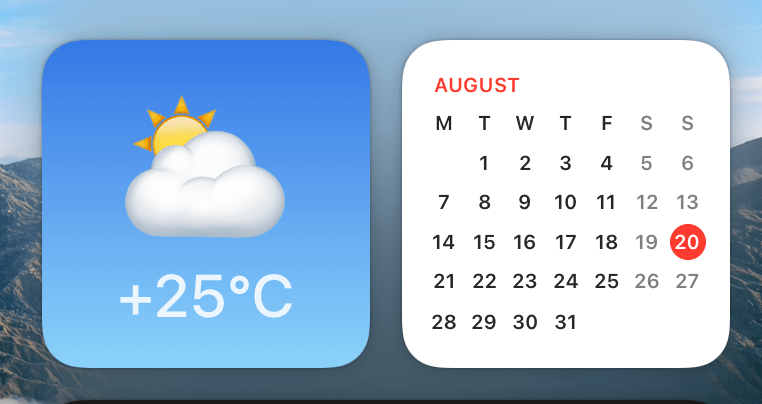

#  YWWidget - Yandex Weather Widget for macOS

Missing Yandex Weather Widget for macOS 🌥

### [💻 Download here 💻](https://github.com/bobrosoft/macos-yandex-weather-widget/releases)

Capabilities:
- shows weather in your place
- can use your location for more precise results
- click on widget will show you more info and forecast in your browser

### Installation
- download latest `YWWidget.zip` from https://github.com/bobrosoft/macos-yandex-weather-widget/releases
- browser may block download of that file, press "Continue Download"
- unpack the archive
- move app to Applications
- run the app, macOS will say something as 
`“YWWidget.app” can’t be opened because Apple cannot check it for malicious software.`
That happens with most software downloaded not through App Store.
- open macOS' "System Preferences" -> "Security & Privacy" -> click "Open Anyway" button
on bottom right.
- follow the instructions in opened window
- you can grant "Location" permissions to make forecast more precise

Author: [Vladimir Tolstikov](https://bobrosoft.com)  
License: MIT
